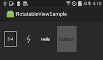
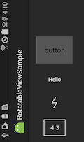

# RotatableView
RotatableView is an android widget.  
When Activity orientation is fixed, RotatableView can be rotation.  
So, RotatableView should use fixed orientation Activity.  

RotatableView is being used by [aillis(LineCamera)](https://play.google.com/store/apps/details?id=jp.naver.linecamera.android) and [Pholar](https://play.google.com/store/apps/details?id=com.naver.android.pholar).

## Screenshot

## Installation
[Android Studio](http://developer.android.com/sdk/index.html)  
Android SDK 21  
Android SDK Build-tools 21.1.2  
(You can change other sdk and build-tools)  

## Usage
RotatableView is going to provide from maven repository.(Not supported yet)

## License
RotatableView is licensed under the Apache License, Version 2.0.
See [LICENSE](LICENSE.txt) for full license text.

        Copyright (c) 2015 Naver Corp.
        @Author Oh kyun Kim, Byung Woong Kwon, Jong Hun Kim

        Licensed under the Apache License, Version 2.0 (the "License");
        you may not use this file except in compliance with the License.
        You may obtain a copy of the License at

                http://www.apache.org/licenses/LICENSE-2.0

        Unless required by applicable law or agreed to in writing, software
        distributed under the License is distributed on an "AS IS" BASIS,
        WITHOUT WARRANTIES OR CONDITIONS OF ANY KIND, either express or implied.
        See the License for the specific language governing permissions and
        limitations under the License.
